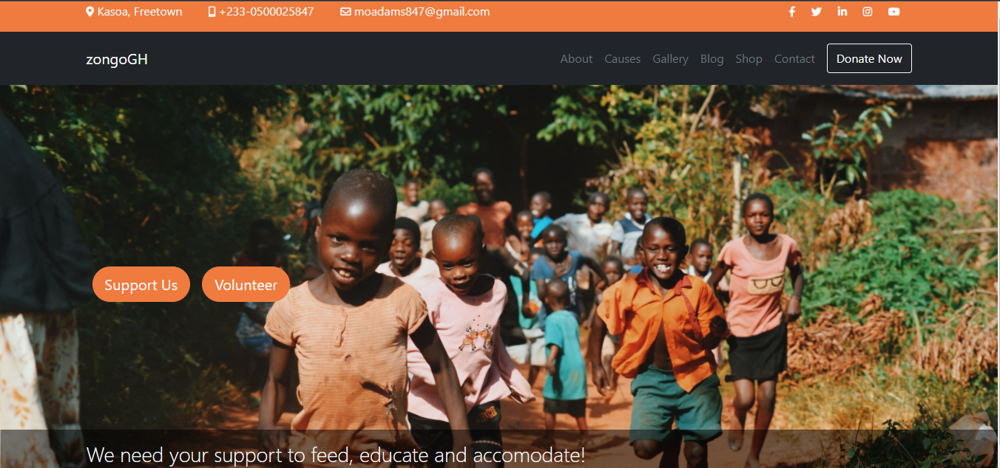

# A zongoGH website

## Motivation

A landing page for a nonprofit organisation that I used to be involved with.

## Screenshot

[]()

## URL

[A zongoGH website](https://youthful-mahavira-d697f1.netlify.app/)

## Installation

1. Clone Repo
2. cd to the directory where cloned folder is locacted
3. run: npm install in your shell

```bash
npm install
```

## Tech/framework used

1. HTML5
2. CSS3
3. SASS
4. Bootstrap 5

## Contributing

Pull requests are welcome. For major changes, please open an issue first to discuss what you would like to change.

## License

[MIT](https://choosealicense.com/licenses/mit/)
